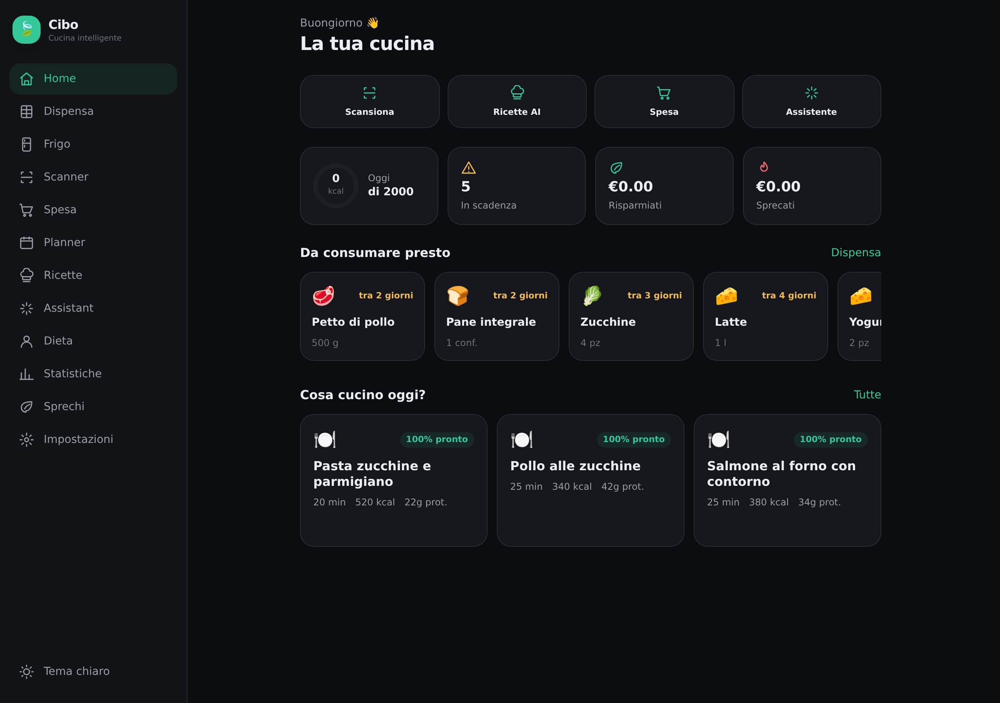
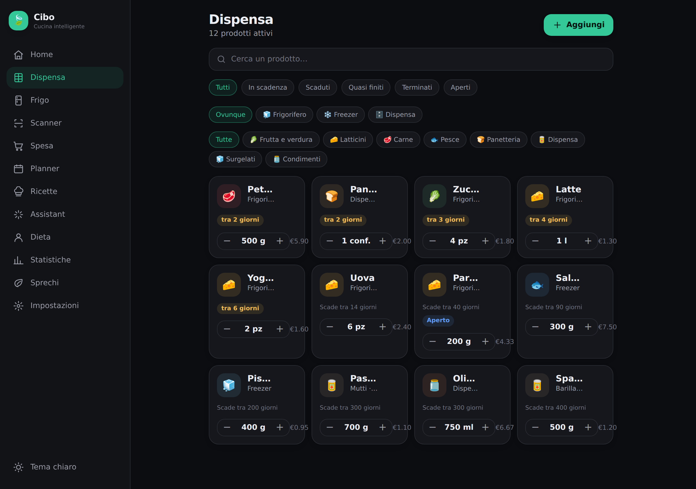
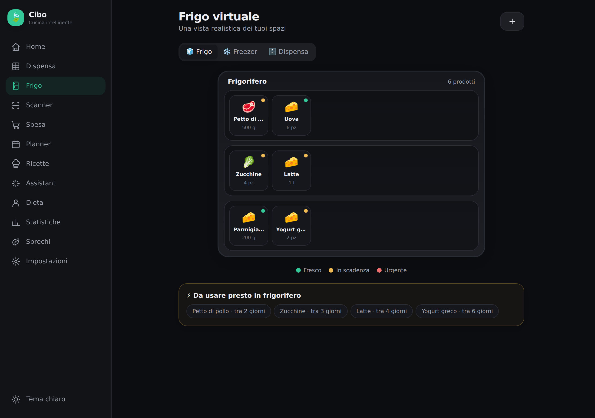
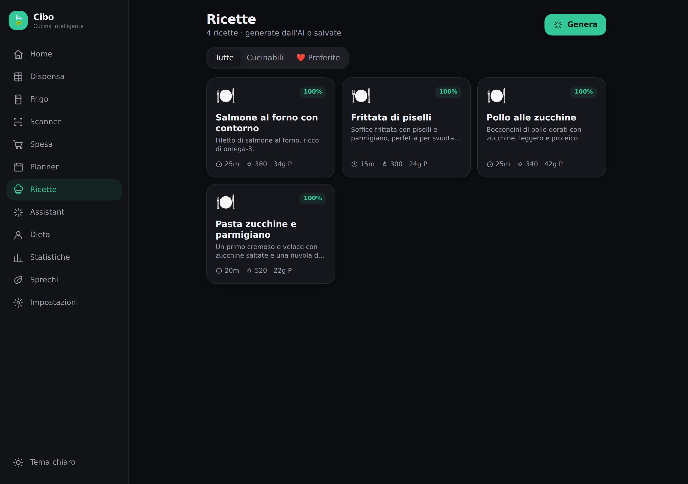
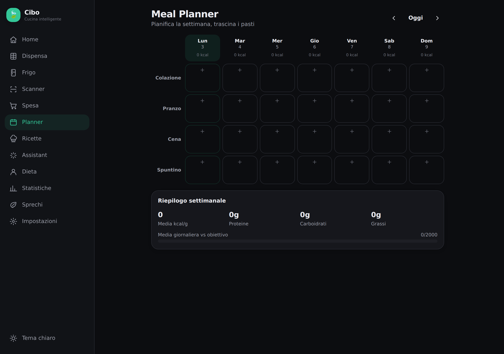
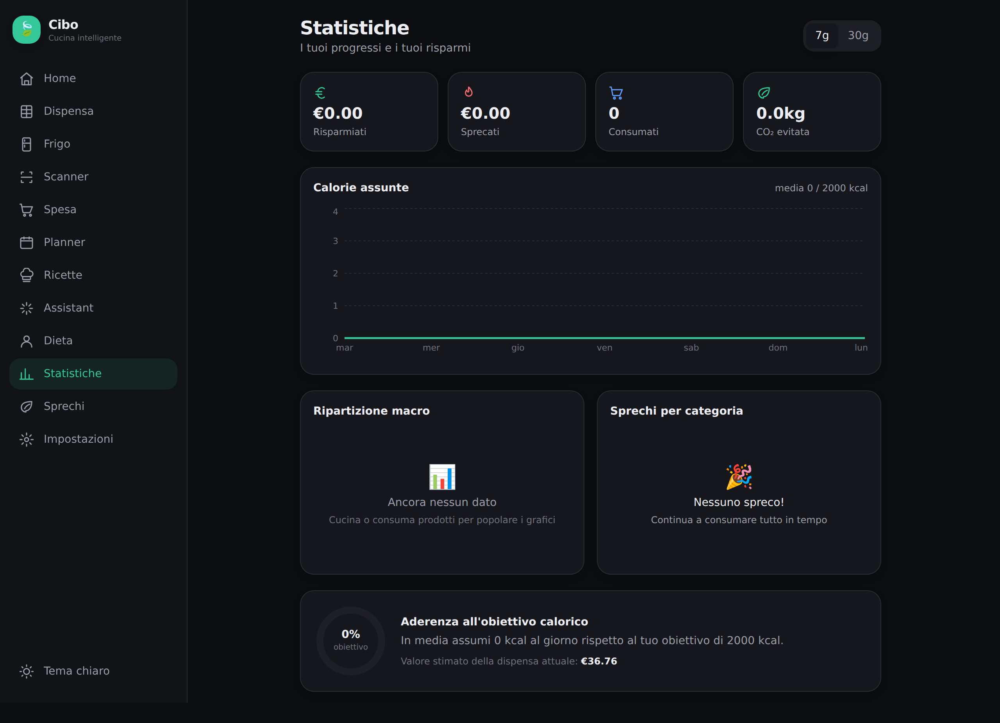
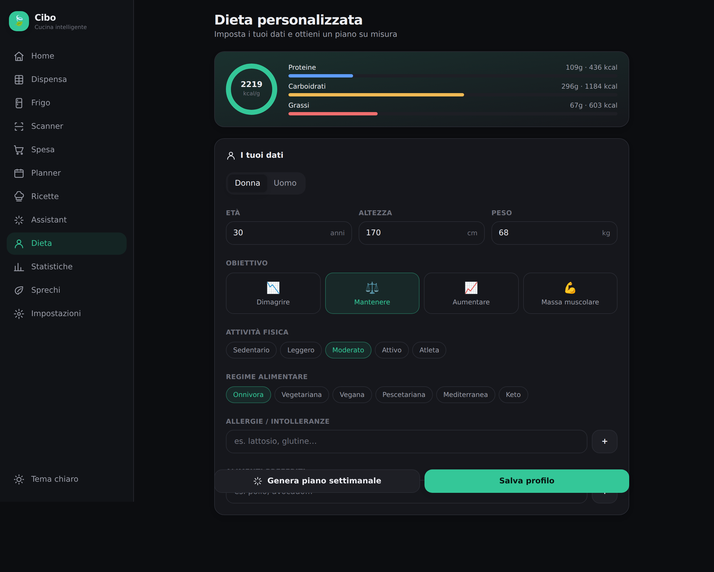
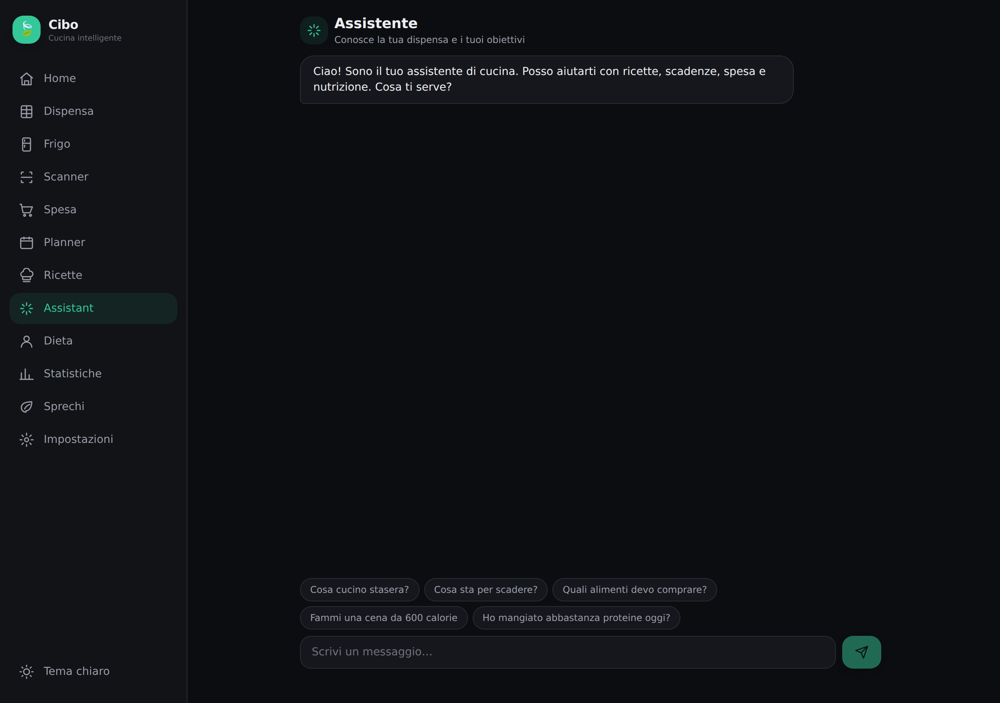
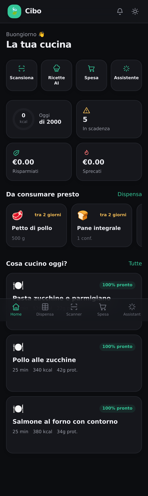

# 🍃 Cibo — Cucina intelligente

**Gestione completa dell'alimentazione domestica.** Dispensa, scadenze, spesa, ricette, nutrizione e AI in un'unica app premium. L'obiettivo non è contare le calorie, ma aiutarti a **mangiare meglio, spendere meno e buttare meno cibo**.

Non è un clone di Yazio / Lifesum / MyFitnessPal: Cibo parte dalla tua **dispensa reale** e collega tutto — scontrini, scadenze, pasti e spesa — in un unico flusso.

---

## ✨ Funzionalità

| # | Funzionalità | Stato |
|---|---|---|
| 1 | **Scanner scontrini** — OCR in-browser (Tesseract), riconosce prodotti, quantità, prezzi, supermercato e data; aggiunge tutto alla dispensa | ✅ |
| 2 | **Scanner codice a barre** — lookup su OpenFoodFacts (nome, marca, categoria, valori nutrizionali, ingredienti, allergeni) + scanner live con `BarcodeDetector` | ✅ |
| 3 | **Dispensa intelligente** — quantità, unità, date, categoria, posizione; scala automaticamente le quantità quando cucini | ✅ |
| 4 | **Frigorifero virtuale** — vista grafica di frigo / freezer / dispensa con filtri (in scadenza, terminati, aperti…) | ✅ |
| 5 | **Scadenze** — notifiche locali 7 / 3 / 1 / 0 giorni prima; ricette prioritarie sui prodotti in scadenza | ✅ |
| 6 | **Lista della spesa intelligente** — generata da prodotti finiti + pasti pianificati; raggruppata per reparto; sposta in dispensa a fine spesa | ✅ |
| 7 | **Meal Planner** — calendario settimanale con drag & drop; ogni pasto aggiorna dispensa, calorie e macro | ✅ |
| 8 | **Ricette AI** — genera ricette dagli ingredienti che hai, con vincoli (max minuti, max kcal, dieta) | ✅ |
| 9 | **Dieta personalizzata** — TDEE (Mifflin–St Jeor), target macro, generazione piano settimanale | ✅ |
| 10 | **Dashboard** — calorie, macro, soldi risparmiati/sprecati, CO₂, prodotti consumati (Recharts) | ✅ |
| 11 | **Gestione famiglia** — membri condivisi; sync realtime via Supabase (blueprint) | ✅ |
| 12 | **AI Assistant** — chat contestuale ("Cosa cucino stasera?", "Cosa sta per scadere?") | ✅ |
| 13 | **Riduzione sprechi** — cibo buttato, soldi persi, alimenti salvati, CO₂, con grafici | ✅ |
| 14 | **Design premium** — stile Apple/Linear/Arc, dark & light mode, animazioni fluide | ✅ |
| 15 | **Architettura pubblicabile** — offline-first, PWA installabile, backend Postgres + RLS | ✅ |

---

## 📸 Anteprima

Screenshot reali dall'app in esecuzione (dati di esempio precaricati) — vedi la cartella [`screenshots/`](./screenshots).

| Home | Dispensa | Frigo virtuale |
|---|---|---|
|  |  |  |
| **Ricette AI** | **Meal Planner** | **Statistiche** |
|  |  |  |
| **Dieta** | **Assistant** | **Mobile** |
|  |  |  |

---

## 🏗️ Stack & architettura

- **Next.js 14 (App Router) + TypeScript** — SSR, PWA, pronto per il wrapping su store
- **Offline-first**: [Dexie](https://dexie.org/) su IndexedDB è la **sorgente di verità**. L'app è pienamente funzionante senza alcun backend o chiave API.
- **Tailwind CSS** + design system a token (light/dark via CSS variables)
- **Recharts** per i grafici della dashboard
- **Tesseract.js** per l'OCR degli scontrini (interamente client-side, offline)
- **OpenFoodFacts** per il lookup dei codici a barre (nessuna chiave richiesta)
- **Anthropic Claude** per ricette e assistente (`/api/ai`), con **fallback euristico** integrato: le funzioni AI funzionano anche senza chiave
- **Supabase** come backend cloud opzionale (auth, Postgres, Storage, Realtime, Push) — schema in [`supabase/migrations`](./supabase/migrations)

### Perché offline-first?
Ogni schermata è realmente funzionante fin dal primo avvio, senza configurazione. Il cloud è un **layer di mirroring** (vedi `src/lib/sync.ts`) che abilita sincronizzazione e condivisione famiglia quando configurato, senza mai bloccare l'esperienza locale.

```
src/
├── app/                # Route (App Router): home, pantry, fridge, scan,
│   │                   # shopping, planner, recipes, assistant, diet,
│   │                   # dashboard, waste, settings
│   └── api/            # /api/ai (Claude + fallback), /api/barcode (OpenFoodFacts)
├── components/         # Design system, AppShell, ItemForm, chart cards, toast…
└── lib/                # db (Dexie), actions (business logic), nutrition,
                        # food metadata, scan (OCR/barcode), ai, sync, format
supabase/migrations/    # Schema Postgres + RLS + realtime (backend blueprint)
public/                 # manifest.json, service worker, icona
```

---

## 🚀 Avvio

```bash
npm install
npm run dev       # http://localhost:3000
```

L'app parte con una **dispensa e ricette di esempio** già popolate. Nessuna chiave necessaria.

### Configurazione opzionale
Copia `.env.example` in `.env.local` e aggiungi:
- `ANTHROPIC_API_KEY` → ricette e assistente basati su Claude (altrimenti motore euristico)
- `NEXT_PUBLIC_SUPABASE_URL` / `NEXT_PUBLIC_SUPABASE_ANON_KEY` → sync cloud + famiglia realtime

```bash
npm run build     # build di produzione
npm run typecheck # controllo tipi
```

---

## 📦 Pronto per la produzione
- ✅ Build di produzione pulita (17 route)
- ✅ TypeScript strict, zero errori
- ✅ PWA installabile + service worker (offline + push)
- ✅ Responsive: mobile bottom-nav + sidebar desktop
- ✅ Dark / Light / Auto con persistenza e no-FOUC
- ✅ Schema DB con Row Level Security per la condivisione famiglia

Fatto con 🍃 per mangiare meglio e sprecare meno.
